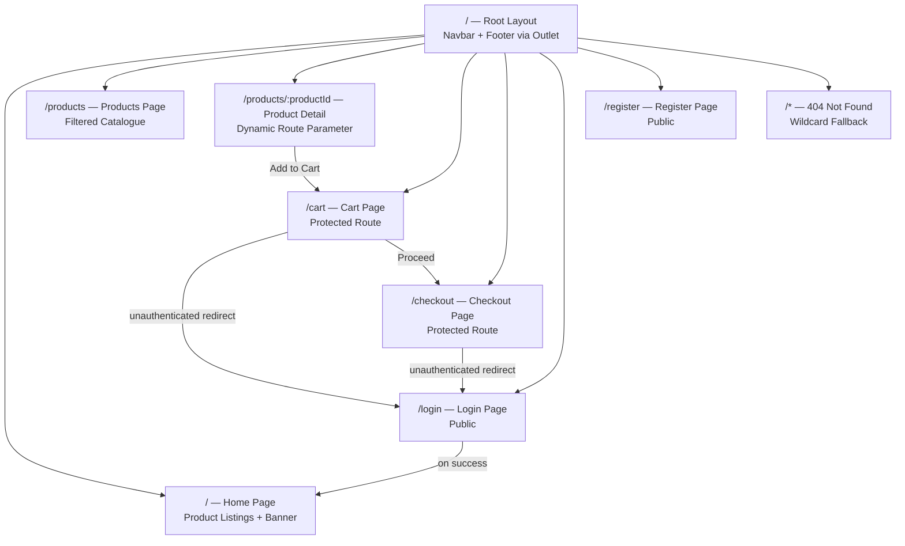
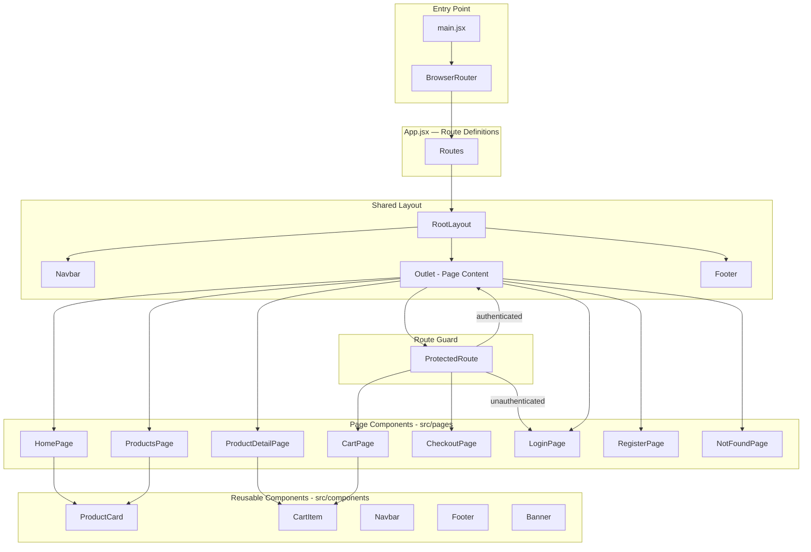
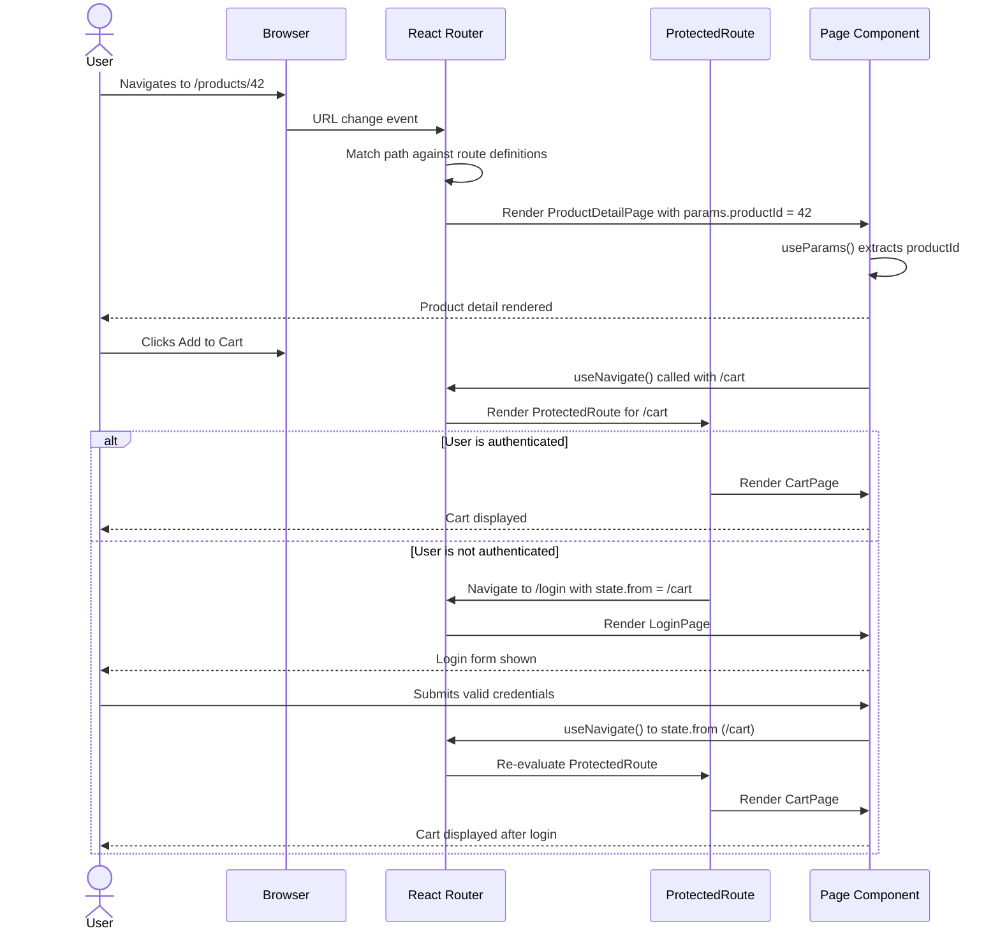

# ShopNest — Routing Assignment

> A fully client-side routed React e-commerce application demonstrating production-grade single-page application navigation patterns using React Router v6 — built as part of the ShopNest Routing Challenge.

---

[](https://shopkart-routing-assignment-three.vercel.app)
[](https://react.dev/)
[](https://reactrouter.com/)
[](https://vitejs.dev/)
[](https://developer.mozilla.org/en-US/docs/Web/JavaScript)
[](https://vercel.com)

---

## Live Demo

Deployment URL : https://vercel.com/hardikkaurani1-4236s-projects/shopkart-routing-assignment/BHNeCdyjrZyZpwvQU4RSUyN5tGZz

> Replace this URL with your own Vercel deployment link once redeployed.

---

## Table of Contents

- [Overview](#overview)
- [Application Route Map](#application-route-map)
- [Component Architecture](#component-architecture)
- [Navigation Flow](#navigation-flow)
- [Tech Stack](#tech-stack)
- [Project Structure](#project-structure)
- [Prerequisites](#prerequisites)
- [Installation](#installation)
- [Running the Application](#running-the-application)
- [Routing Implementation](#routing-implementation)
- [Deployment](#deployment)
- [Contributing](#contributing)
- [License](#license)

---

## Overview

ShopNest is a React single-page application that demonstrates the full spectrum of React Router v6 routing patterns in a realistic e-commerce context. The application covers declarative route definitions, nested routing with shared layouts, dynamic route parameters for product detail pages, programmatic navigation, protected routes for authenticated flows, and a custom 404 fallback.

The assignment objective was to implement routing across an existing component tree without modifying the core UI components — purely wiring navigation logic through React Router primitives.

Key routing concepts demonstrated:

- **Nested routes with shared layouts**: The main layout (navbar, footer) wraps all page routes as child routes, rendered via `<Outlet />`, eliminating layout duplication.
- **Dynamic segments**: The product detail page uses `:productId` as a URL parameter, resolved with `useParams()` inside the component.
- **Programmatic navigation**: Add-to-cart and checkout flows use `useNavigate()` to redirect after action completion.
- **Protected routes**: Cart and checkout pages are wrapped in a guard component that redirects unauthenticated users to `/login`.
- **404 handling**: A wildcard `*` route catches all unmatched paths and renders a dedicated Not Found page.

---

## Application Route Map



---

## Component Architecture



---

## Navigation Flow



---

## Tech Stack

| Technology | Version | Purpose |
|---|---|---|
| React | v18 | UI component library |
| React Router | v6 | Client-side routing |
| Vite | Latest | Build tool and HMR dev server |
| JavaScript (ES2022) | — | Application language |

---

## Project Structure

```
shopkart-routing-assignment/
|
+-- public/                          # Static assets served directly
|   +-- index.html                   # HTML shell - React mounts here
|   +-- favicon.ico
|   +-- assets/                      # Images, fonts
|
+-- src/                             # All application source code
|   +-- components/                  # Reusable UI components
|   |   +-- Navbar.jsx               # Top navigation with React Router Links
|   |   +-- Footer.jsx
|   |   +-- ProductCard.jsx          # Renders a single product tile with Link
|   |   +-- CartItem.jsx             # Cart row component
|   |   +-- Banner.jsx               # Homepage hero banner
|   |   +-- ProtectedRoute.jsx       # Auth guard wrapper using Navigate
|   |
|   +-- pages/                       # Route-level page components
|   |   +-- HomePage.jsx             # / — Product grid + banner
|   |   +-- ProductsPage.jsx         # /products — Filtered catalogue
|   |   +-- ProductDetailPage.jsx    # /products/:productId — Dynamic detail
|   |   +-- CartPage.jsx             # /cart — Protected
|   |   +-- CheckoutPage.jsx         # /checkout — Protected
|   |   +-- LoginPage.jsx            # /login
|   |   +-- RegisterPage.jsx         # /register
|   |   +-- NotFoundPage.jsx         # /* — 404 fallback
|   |
|   +-- layouts/
|   |   +-- RootLayout.jsx           # Navbar + Outlet + Footer wrapper
|   |
|   +-- context/
|   |   +-- AuthContext.jsx          # Authentication state - useContext
|   |   +-- CartContext.jsx          # Cart state - items, count, total
|   |
|   +-- hooks/
|   |   +-- useAuth.js               # Consume AuthContext
|   |   +-- useCart.js               # Consume CartContext
|   |
|   +-- data/
|   |   +-- products.js              # Static product data / mock API responses
|   |
|   +-- App.jsx                      # Route definitions using Routes and Route
|   +-- main.jsx                     # ReactDOM.createRoot, BrowserRouter wrapper
|
+-- .gitignore
+-- package.json
+-- package-lock.json
+-- README.md
```

---

## Prerequisites

| Requirement | Version | Notes |
|---|---|---|
| Node.js | v16+ | [nodejs.org](https://nodejs.org/) |
| npm | v8+ | Bundled with Node.js |

```bash
node --version    # v16+
npm --version     # v8+
```

---

## Installation

```bash
# Clone the repository
git clone https://github.com/hardikkaurani/shopkart-routing-assignment.git
cd shopkart-routing-assignment

# Install dependencies
npm install
```

---

## Running the Application

**Development mode** — Vite dev server with hot module replacement:

```bash
npm run dev
# App available at http://localhost:5173
```

**Production build:**

```bash
npm run build
# Output: dist/
```

**Preview production build locally:**

```bash
npm run preview
# Serves the dist/ build at http://localhost:4173
```

---

## Routing Implementation

The entire routing configuration lives in `src/App.jsx`. The structure uses React Router v6's nested route pattern:

```jsx
import { Routes, Route } from 'react-router-dom';
import RootLayout from './layouts/RootLayout';
import ProtectedRoute from './components/ProtectedRoute';

// Page imports...

function App() {
  return (
    <Routes>
      <Route path="/" element={<RootLayout />}>
        <Route index element={<HomePage />} />
        <Route path="products" element={<ProductsPage />} />
        <Route path="products/:productId" element={<ProductDetailPage />} />
        <Route path="login" element={<LoginPage />} />
        <Route path="register" element={<RegisterPage />} />

        {/* Protected routes */}
        <Route element={<ProtectedRoute />}>
          <Route path="cart" element={<CartPage />} />
          <Route path="checkout" element={<CheckoutPage />} />
        </Route>

        {/* 404 fallback */}
        <Route path="*" element={<NotFoundPage />} />
      </Route>
    </Routes>
  );
}
```

**Dynamic parameter resolution in `ProductDetailPage`:**

```jsx
import { useParams } from 'react-router-dom';

function ProductDetailPage() {
  const { productId } = useParams();
  // Fetch or filter product data using productId
}
```

**Protected route guard pattern:**

```jsx
import { Navigate, Outlet, useLocation } from 'react-router-dom';
import { useAuth } from '../hooks/useAuth';

function ProtectedRoute() {
  const { isAuthenticated } = useAuth();
  const location = useLocation();

  return isAuthenticated
    ? <Outlet />
    : <Navigate to="/login" state={{ from: location }} replace />;
}
```

---

## Deployment

The application is deployed on Vercel with automatic deployments on every push to `main`.

**Live URL**: [shopkart-routing-assignment-three.vercel.app](https://shopkart-routing-assignment-three.vercel.app)

> **Replace this section** with your own deployment URL once redeployed:
> ```
> Live URL: https://your-project-name.vercel.app
> ```

### Deploy Your Own Fork

**Option A — Vercel CLI:**

```bash
npm install -g vercel
vercel
# Follow the prompts — Vercel auto-detects Vite config
```

**Option B — Vercel Dashboard:**

1. Push your fork to GitHub
2. Go to [vercel.com/new](https://vercel.com/new)
3. Import the repository
4. Framework preset: **Vite** (auto-detected)
5. Click **Deploy**

### Important — SPA Routing on Vercel

React Router uses the HTML5 History API. Direct URL access to routes like `/products/42` will return 404 on a static host unless a rewrite rule is configured. Add a `vercel.json` at the root:

```json
{
  "rewrites": [
    { "source": "/(.*)", "destination": "/index.html" }
  ]
}
```

This ensures all requests are served the React app shell, allowing the client-side router to handle the path.

---

## Contributing

1. Fork the repository
2. Create a feature branch:
   ```bash
   git checkout -b feature/your-feature-name
   ```
3. Commit with a descriptive message:
   ```bash
   git commit -m "feat: add breadcrumb navigation to product detail page"
   ```
4. Push and open a Pull Request against `main`

---

## Roadmap

- Persistent cart state using localStorage
- Product search with URL-synced query parameters (`/products?search=shoes`)
- Pagination with URL-based page state (`/products?page=2`)
- Animated page transitions using Framer Motion
- Lazy loading of route components with `React.lazy` and `Suspense`
- Unit tests for route guard behaviour with React Testing Library

---

## License

This project is open source under the MIT License.

---

## Contact

- **Author**: Hardik Kaurani
- **Email**: hardikkaurani2@gmail.com
- **Repository**: [github.com/hardikkaurani/shopkart-routing-assignment](https://github.com/hardikkaurani/shopkart-routing-assignment)

---

*Built with React Router v6. Deployed on Vercel.*


